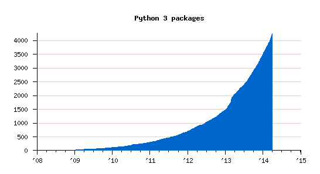
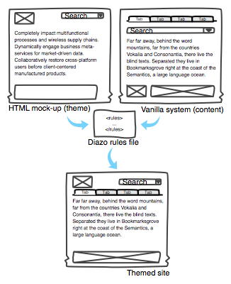

:skip-help: true
:title: Who's Afraid of the Big Bad 3
:auto-console: false
:css: css/slides.css

----

Who's Afraid of the Big Bad 3
=============================

Lennart Regebro
---------------

PyCon Ireland, Dublin 2014

----

:data-x: r0
:data-y: r1000

<Cue dramatic music!>
=====================

----

:data-x: r1600
:data-y: r0

Who wants Python 3 anyway?
==========================

Python 2 is good enough!
------------------------

----

You will have to spend hundreds of man-hours!
=============================================

----

There are no third-party modules!
=================================

----

Python 3 was a mistake!
=======================

----

No other language ever break backwards compatibility!
=====================================================

----

Everything breaks!
==================

----

Python 3 is really a new language!
==================================

----

Doesn't anyone listen to us?
============================

----

:data-x: r-1600

.. note::

    If it was a new language, then you would get confused when reading Python 3 code.
    You would not be entirely sure what the code would do, as bits of it wouldn't make sense.
    That is not the case, I promise.

----

.. note::

    Not all code breaks, but yes, every non-trivial package is likely to break.
    But that does not mean it's hard to fix, and I'll look at that later.

----

.. note::

    In August I saw Armin Ronacher tweet about compiling early versions of Python.
    It took a little bit of effort and even then Python apparently crashed on exit.
    Is C then really backwards compatible?
    Code will not continue to run forever without change.

    But yes, they have a point, changes this big are unusual, perhaps unheard of.

----

.. note::

    Could Python 3 have been backwards compatible?

    No.
    There was several mistakes in Python 2 that could only be fixed by breaking backwards compatibility.
    The biggest of these is of course the way Unicode was handled.
    Another example is that you can compare strings and numbers.

    Most other mistakes has been handled by adding a second way of doing it.
    But some things that they wanted to change could not be done that way.
    Backwards compatibility had to be broken.

    And then it was decided to also clean up the cases where there were two ways of doing things, like range and xrange.
    Because there is a big reason that Python is popular: Python fits your brain.
    And if we want Python to continue to be everyones favourite language, it must continue to do that.

    So no, I don't think Python 3 was a mistake.

----

.. note::

    There ARE third party-modules.

----

:data-x: r0
:data-y: r1000

Time to Third-party!
====================

* 165 of the 200 top packages on the Cheeseshop support Python 3

* Over 4000 Python 3 packages on the Cheeseshop.

.. note::

    165 of 200 are not too shabby.

    And 3 packages (Paste, python-cloudfiles, ssh) is deprecated and will not be ported.

    6 packages are not libraries, but applications so you don't really need Python 3 support very much.

    So really, it's only 26 of the top 200 packages that still need to support Python 3.
    And work is ongoing for most of them.

----

:data-x: r-3200
:data-y: r-1000

----

:data-x: r0
:data-y: r1000

You want Python 3!
==================

Although you might not know it yet
----------------------------------

.. note::

    Here are just some of the goodies in Python 3

----

Extended Iterable Unpacking
===========================

.. code::

    >>> first, second, *rest, last = \
    ...     "a b c d e f".split()
    >>> first, second, last
    ('a', 'b', 'f')

.. note::

    The `*rest` bit will take anything that doesn't end up in any other variables.
    You can only have one `*rest` per line, of course, but you can have both a first and a second, etc.

----

Keyword only arguments
======================

.. code::

    >>> def foo(a, *args, b, **kw):
    ...   print(a, args, b, kw)

    >>> foo(1, 2, 3, b=4, c=5)
    1 (2, 3) b {'c': 5}

.. note::

    This looks like the Extended Iterable Unpacking!
    And it works in a similar way.
    Another example of how Python fits your brain.

    The main effect of that is that you HAVE to pass in b as a keyword paremeter.
    `*args` will eat anything else.

----

Chained exceptions
==================

.. code::

    >>> raise KeyError("wut?") from ZeroDivisionError()
    ZeroDivisionError

    The above exception was the direct cause of
    the following exception:

    Traceback (most recent call last):
      File "<stdin>", line 1, in <module>
    KeyError: 'wut?'

.. note::

    In Python 2, if you raise an exception during exception handling, the original exception is lost.
    In Python 3 you can chain them, and get both tracebacks, which is really handy for debugging.

    You don't actually have to explicitly chain them in this case, they will be implicitly chained.
    But raise from will chain exceptions even when it's not in a try/except case.

----

Better OS Exceptions
====================

.. code::

           BlockingIOError ChildProcessError
           ConnectionError BrokenPipeError
    ConnectionAbortedError ConnectionRefusedError
      ConnectionResetError FileExistsError
         FileNotFoundError InterruptedError
         IsADirectoryError NotADirectoryError
           PermissionError ProcessLookupError
              TimeoutError

.. note::

    Is Python 2, loads of errors are hidden behind the OSError exceptions.
    In Python 3.3, you have many separate exceptions, which all inherit from OSerror.
    For example you can now get a FileExistsError and a NotADirectoryError.
    This makes it much simpler to handle different errors separately.

----

File handle warnings
====================

.. code::

    __main__:1: ResourceWarning: unclosed file

.. note::

    If you don't close a file, you will get a warning when the file object is garbage collected.
    Very nice to make sure you don't leave open files around.

----

Yield from
==========

.. code::

    >>> def my_generator():
    ...     yield from range(1,5)
    ...     yield from range(10,15)
    ...
    >>> list(my_generator())
    [1, 2, 3, 4, 10, 11, 12, 13, 14]

.. note::

    You also have `yield from`, which let's you delegate your generator to a subgenerator.
    Extremely handy.

----

Simply super
============

Python 2
--------

.. code::

    super(ClassName, self).method(foo, bar)

Python 3
--------

.. code::

    super().method(foo, bar)

----

asyncio
=======

.. note::

    There are several new modules in later versions of Python 3.
    Most of them have backports so you can use them anyway.

    But one does not have a Python 2 backport, and that's asyncio.
    It's basically like Twisted, Gevent or Tornado, but with generators.
    It seems very cool, and you need Python 3.3 or later for that.

----

:data-x: r1600
:data-y: r-9000

.. note::

    Well, this really depends on the code you need to fix, and how much code of course.

    But essentially this might have been True in 2008 or 2009,
    both because you needed to support Python 2.4 and Python 3.1,
    but also because less libraries were available,
    so you needed to port more libraries that you didn't write.

    But today the situation is very different.
    Let's look at that.

----

:data-x: r0
:data-y: r-1000

Supporting Python 3 is not so bad
=================================

.. note::

    Although every package is likely to break in some way, most code will not break.

----

:data-x: r1600
:data-y: r0

Many changes are handled by 2to3
================================

* Exception syntax

* `print` is a function

* `xrange` is gone

* Standard library reorganisation

* etc...

.. note::

    Most changes are handled by 2to3, but maybe not always in the prettiest way.

----

Some changes need no handling at all
====================================

* dict.keys() no longer returns a list

* Indentation is stricter

* Long and Int are merged

.. note::

    Other changes typically will not affect you at all, unless you are violating good coding practices.

----

If you need Python 2 compatibility
==================================

.. code:: python

    >>> from __future__ import division
    >>> from __future__ import print_function
    >>> print("Three halves is written", 3/2, "with decimals.")
    Three halves is written 1.5 with decimals.

.. note::

    Other changes has explicit forward compatibility, like the new division and the print function.
    This is useful if you need to keep Python 2 compatibility,
    which you typically only need if you are adding Python 3 support to a library.

----

u'' is back!
============

.. note::

    Some backwards compatibility has also been added back in later Python 3 versions.
    The most important of those is that in Python 3.3 the u'' prefix for Unicode was added back.
    In addition there are now libraries out there that will help you, like six and futurize.

    This means that as long as you don't need to support Python 2.5 or Python 3.2,
    writing code that runs on both Python 2 and Python 3 is not that hard.

----

:data-x: r-6400
:data-y: r-1000

So what IS hard?
================

----

:data-x: r1600
:data-y: r0

API changes
===========

.. note::

    If you need to change your libraries API to be Python 3 compatible, that's a pain.

----

Example 1: zope.interface
=========================

.. code::

    class TheComponent(object):
        implements(ITheInterface)

.. note::

    This syntax used in Python 2 relies on how metaclasses work in Python 2.
    The implements statement is actually executed, and it inserts a metaclass in the local context,
    which in turn makes the class creation use a metaclass.

    This doesn't work in Python 3, because metaclasses are not declared in the class body.

----

Example 1: zope.interface
=========================

.. code::

    @implementor(ITheInterface)
    class TheComponent(object):
        pass

.. note::

    But instead there is now class decorators.
    So the API needed to change.

    Lesson learned: Don't use Python magic as an API.
    That said, when this API was created in 2001 there wan't much choice.

    A fixer was needed to make it possible to change the API with 2to3.
    Writing fixers is HARD partly because it's badly documented.
    Try to avoid it.

----

Example 2: icalendar
====================

.. code::

    ical = str(icalendarobject)

.. note::

    In the module called icalendar there are icalendar objects.
    These represent an icalendar file, and to make the file you just make it into a string.
    The result is a UTF-8 encoded iCalendar string.

    But in Python 3, strings are Unicode. So this fails.

----

Example 2: icalendar
====================

.. code::

    ical = icalendarobject.to_ical()

.. note::

    Much better.

    Lesson learned: Don't use dunder methods as an API.

----

:data-x: r-8000
:data-y: r-1000

Bytes/Strings/Unicode
=====================

.. note::

    And you may then wonder what it is that prompts some influential heavyweights to complain so much about Python 3.
    And the biggest issue is bytes/strings/unicode.

    But avoiding strings, bytes and Unicode is less easy.

    And the biggest issue is that the API for bytes and strings are slightly different.
    For example, if you iterate over a string, the values you get are one-character strings.
    However, if you iterate over a bytes string, you get integers!
    There are other differences as well, and this makes it hard to support both bytes and strings with the same API.

----

:data-x: r1600
:data-y: r0

You gotta keep'em separated!
============================

.. note::

    This means that you need to always cleanly separate when you work with binary data,
    and when you work with textual data.
    Don't use the same variables or functions for both Unicode text and binary data, if you can avoid it.

----

:data-x: r-1600
:data-y: r-1000

----

:data-x: r1600
:data-y: r0

Practical Experiences
=====================

.. note::

    When preparing for this talk I decided to look at the current state of Python 3 support.
    I wanted to know how difficult it would typically be to help port the libraries you depend on.

    To do that I needed to port some package that I didn't already know intimately,
    that did webby stuff that required both Unicode and Bytes handling,
    which needed both Python 2 and Python 3 support,
    and which nobody had tried to add Python 3 support already.

    And I found Diazo.

----

:data-x: r1600
:data-y: r0

Diazo
=====

.. note::

    Diazo takes two HTML pages and maps bits of one page into another page according to a rule-set.
    It means you can have a designer create the design as static HTML
    and then you can map your dynamic site into that design without even modifying your site.
    So you can style your PHP site or your Plone site without actually knowing either PHP or Plone.
    Brilliant! We've used it on pretty much any site I've been involved with the last 4 years.

    This principle was first made by another application called called Deliverence,
    but Diazo implements it by compiling the rules into XSLT.
    You can then let nginx or apache do this mapping.
    Or you can use the included WSGI server, or you can use it as a library inside your web framework.

    So, how did I add Python 3 support?

----

Tool 1: caniusepython3
======================

https://caniusepython3.com/

.. code::

    $ caniusepython3 --project diazo

    You need 3 projects to transition to Python 3.
    Of those 3 projects, 2 has no direct
    dependencies blocking its transition:

      repoze.xmliter (which is blocking diazo)
      experimental.cssselect (which is blocking diazo)

.. note::

    This is both a command line tool and a website.
    It's not perfect, but it's helpful as a way to evaluate the application.
    In this case it turns out that experimental.cssselect works under Python 3, but does not declare it.

    So I checkout out repoze.xmliter, which turns out to use a package called collective.checkdocs that didn't support Python 3.
    caniusepython3 doesn't report that, because it's a package used during development and not a requirement.
    I could have just dropped the usage of collective.checkdocs, but I decided to add Python 3 support to it instead.

----

:data-x: r-4800
:data-y: r-1000

Adding Python 3 support to collective.checkdocs
===============================================

.. note::

    collective.checkdocs is a small utility to check that your package description renders to HTML properly.
    I mailed the original author to ask for permission, and I added some simple tests to the module as it had no tests.

----

:data-x: r1600
:data-y: r0

Tool 2: 2to3
============

.. code::

    $ 2to3 -w .

.. note::

    I then ran 2to3 on the code to update things to Python 3.
    It didn't work perfectly, I needed to clean up the imports manually.
    I also needed to add a from __future__ import print_function to get it to run under Python 2.

    I added Python 3.2, 3.3 and 3.4 to the list of supported versions in setup.py,
    and cleaned up things a bit, add a MANIFEST.in etc, and release the module to Cheeseshop.

----

collective.checkdocs
====================

Time spent: ~4h
---------------

.. note::

    Total time spent, including some false starts and some problems I had with unrelated tools: Around 4 hours.

----

:data-x: r-3200
:data-y: r-1000

Adding Python 3 support to repoze.xmliter
=========================================

.. note::

    repoze.xmliter is a wrapper to lxml that you can iterate over.
    It will then give you chunks of byte strings of XML.

    Not the most exiting module on Cheeseshop, but it is interesting for this talk, as it needs to handle both binary data and text!
    This as we know, make it a Tricky Module.

    So how did I port it?
    This time 2to3 made a lot of changes, and of course broke the module under both Python 2 and Python 3.
    And trying to figure out if it was the tests that were broken or the module was very hard.
    So I ended up starting over.

    Then, I ran the tests under Python 3, and fixed problem by problem, manually.
    And efter each fix, I checked to make sure it was still running under Python 2.
    And that brings us to Tool 3.

----

:data-x: r1600
:data-y: r0

Tool 3a: Tox
============

.. code::

    $ tox

    __________________ summary __________________
      py26: commands succeeded
      py27: commands succeeded
    ERROR:   py34: commands failed
      pep8: commands succeeded

.. note::

    To make sure your module runs on several versions of Python you can use tox.
    It will create a virtualenv for each Python version you want to support and run the tests with it.
    This makes for a quick way to run tests under multiple Python versions.

    A small caveat emptor: I have loads of problems with it not working for certain Python version etc.
    I think it used to be good but seems to have become quite brittle,
    but I haven't had time to look into it.

----

Tool 3b: Virtualenv + bash
==========================

.. code::

    $ virtualenv-2.7 .venv/py27
    $ virtualenv-3.4 .venv/py34

And a small script:

.. code::

    #!/bin/bash
    .venv/py27/bin/python setup.py test
    .venv/py34/bin/python setup.py test

.. note::

    In that case you can simply create virtualenvs for the Python versions you support, and make a small script.
    If you have many tests you may need to scroll back to see if the tests passed or not but it works.

----

The Unicode problem
===================

.. code::

    if sys.version_info > (3,):
        unicode = str

    doctype_re_b = re.compile(
        b"^<!DOCTYPE\\s[^>]+>\\s*", re.MULTILINE)
    doctype_re_u = re.compile(
        u"^<!DOCTYPE\\s[^>]+>\\s*", re.MULTILINE)

    if isinstance(result, unicode):
        result, subs = doctype_re_u.subn(
            self.doctype, result, 1)
    else:
        result, subs = doctype_re_b.subn(
            self.doctype.encode(), result, 1)

.. note::

    So, it's a tricky module with unicode issues.
    A lot of the fixes I had to do was just making string literals into byte literals, especially in the tests.
    But I also had to in some cases add tests to check if a variable was bytes or unicode.

    And here we come to one of the biggest complaints about Python 3 that is actually true:
    This type of code often ends up ugly, and as we all know, type checking is unpythonic.

    I also needed to add tests for the Unicode support in repoze.xmliter.
    The support was there, but there were no tests for it.

----

repoze.xmliter
==============

Time spent: < 6h
----------------

.. note::

    In total the work to support Python 3 including false starts, cleanups and added tests was no more than 6 hours.

----

:data-x: r-6400
:data-y: r-1000

Adding Python 3 support to Diazo
================================

.. note::

    Now time had come to Diazo itself.
    And then it's time for another tool, futurize!

----

:data-x: r1600
:data-y: r0

Tool 4: Futurize
================

.. code::

    $ pip install future

.. note::

    Future is a compatibility layer between Python 2 and Python 3,
    and also a set of fixers for 2to3 that preserve compatibility between Python 2 and Python 3.
    These sets of fixers are called futurize for moving from Python 2 to Python 3,
    and pasteurize for going the other way.

    So I tried to use futurize here, but that didn't work.
    In fact, I tried it for repoze.xmliter as well, and it didn't work then either.
    After running futurize the code stopped working in Python 2, and still did not work in Python 3.
    I fought with this a bit with repoze.xmliter, and ended up starting over.

    With Diazo I again first quickly tried to run the code through futurize to see if it would still work with Python 2 afterwards.
    Again it would not, so I did the same thing I did with repoze.xmliter, and would run the tests under Python 3,
    fix a test failure, make sure it still ran under Python 2, and then repeat.

    In the case of Diazo I was affected a lot by the import reorganization, so what I did here was I included future as a dependency,
    and I when I found a problem I would find a fixer that could solved that problem, and I ran that specific fixer.

----

Running a single fixer
======================

.. code::

    futurize -w -f <thespecificfixer> .

.. note::

    I could fix most problems like this, again except without Unicode problems.
    This is faster than doing the changes manually, unless you can do the changes with search and replace.

    The main thing I needed to do manually after this, was to change all the tests to use byte strings instead of native strings,
    and switch from cStringIO to io.BytesIO.

    When I submitted te Python 3 support as a pull request on github,
    I got some feedback about the way future's import hooks were used.
    It turned out when reading the code, that these import hooks were not actually needed.
    So I recommend you to look carefully at the changes each fix does to see if all it does is really needed,
    because sometimes it's not.

----

:data-x: r-3200
:data-y: r-1000

Updating the Diazo documentation
================================

.. note::

    The Diazo buildout includes a default test setup with Paste so you can develop your theme rules without nginx or Apache.
    But Paste is will not get support for Python 3.
    The test setup also uses a three Paste apps, like urlmap, static and proxy,
    and the documentation was based on using PasteDeploy-style ini-files to configure the server.
    So I needed to use a WSGI server that uses PasteDeploy and runs on both Python 2 and Python 3.

----

:data-x: r1600
:data-y: r0

Updating the documentation
==========================

1. Replace the WSGI server with gearbox

2. Replace Paster#urlmap with rutter

3. Replace Paster#static with ???

4. Replace Paster#proxy with ???

.. note::

    There is also a replacement for Pasters urlmap application in rutter.
    The replacements for Paster static and Paster proxy exists in WebOb, but WebOb has no PasteDeploy entrypoints.

----

Introducing webobentrypoints
============================

1. Replace the WSGI server with gearbox

2. Replace Paster#urlmap with rutter

3. Replace Paster#static with webobentrypoints#staticdir

4. Replace Paster#proxy with webobentrypoints#proxy

.. note::

    So I started a package simply called "webobentrypoints".
    As of today, it only contains PasteDeploy entry points for the static directory app and using the client app as a proxy,
    because that's what was needed. I'll try to get time to add entry points for the other apps as well.

    This took a long time because I neede to learn about the PasteDeploy entry points,
    and I needed to re-learn WSGI which I hadn't looked at for years.

    All in all this probably took 4-6 hours, of which maybe one was spent actually making the webobentrypoints package.

----

Diazo
=====

Adding Python 3 support to Diazo: ~3h
-------------------------------------

Switching from Paster: < 6h
---------------------------

.. note::

    So total time for Diazo itself was around 8 hours.

----

:data-x: r-4800
:data-y: r-1000

Total time: Less than 20 hours!
===============================

.. note::

    So total time to add Python 3 support to Diazo was 15 to 20 hours.

    That included porting collective.checkdocs, repoze.xmliter, Diazo and writing webobentrypoints.
    Much of the time was not spent actually porting, but learning what the various modules actually did.

    repoze.xmliter and Diazo has not been release in Python 3 compatible versions yet, but that will happen sooner or later.

----

:data-x: r-1600
:data-y: r0

General workflow
================

1. caniusepython3

2. Make sure you have tests

3. Fix one problem at a time

----

Fixing problems
===============

1. Run fixers one by one

2. 2to3 or Futurize

3. Review the changes

----

:data-x: r0
:data-y: r1000

Conclusions
===========

* No, Python 3 is not a mistake!

* Yes, you want to use Python 3.

* No, it's really not that hard (mostly).

----

Just Do It!
===========

----

Yes We Can!
===========

----

YOLO!
=====

----

Been there, done that!
======================

----

You can do it!
==============

----

Thanks!
=======

Props to

* Aaron Meurer's talk "`10 awesome features of Python that you can't use because you refuse to upgrade to Python 3
  <http://asmeurer.github.io/python3-presentation/slides.html>`_"

* Loads of People on Twitter

* PyCon Ireland for inviting me

----

:data-x: r-1600
:data-y: r0

Questions?
==========

.. image:: images/questions.jpg

----

:data-scale: 30
